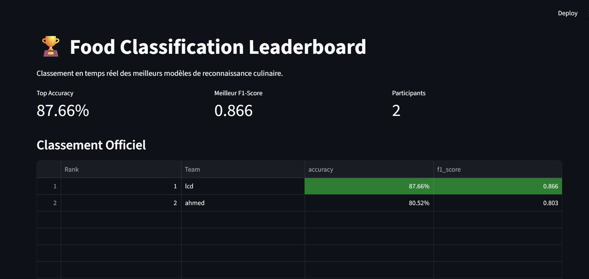

# 🍲 Food Image Recognition Challenge

## 📌 Overview

This challenge focuses on training a **Deep Learning model capable of recognizing food dishes from images**.

Participants must build an **image classification system** that predicts the correct food category for each image.

The goal of this project is to practice **Computer Vision with Deep Learning**, especially using:

- Convolutional Neural Networks (CNNs)
- Transfer Learning
- Data augmentation techniques

### Example Classes

Some examples of food categories included in the dataset:

- Akara  
- Banga Soup  
- Massa  
- Ewedu Soup  
- Jollof Rice  

---

# 📂 Dataset

We will use the **Nigerian Food Dataset** available on Mendeley:

👉 https://data.mendeley.com/datasets/2vktdxfxv7/2  
*(This is the dataset to use for the challenge.)*

### Dataset Content

The dataset contains:

- Images of various Nigerian food dishes
- Labels corresponding to each food category
- Training and test splits

Participants must train their models using the **training images** and generate predictions for the **test images**.

---

# 🎯 Learning Objectives

By completing this challenge, participants will learn how to:

- Build an **image classification pipeline**
- Train **Convolutional Neural Networks (CNNs)**
- Apply **image preprocessing and data augmentation**
- Use **transfer learning** with pretrained models
- Compare different model architectures
- Evaluate models using appropriate metrics

---

# ⚙️ Project Workflow

Participants are expected to follow the typical **machine learning workflow**.

## 1️⃣ Download the Dataset

Download the dataset and place it inside the `data/` directory.

Example:
```text 
    data/
    ├── train/
    └── test/ 
```


---

## 2️⃣ Data Preprocessing

Typical preprocessing steps include:

- Resize images (e.g., **224 × 224**)
- Normalize pixel values
- Convert images to tensors

### Data Augmentation (Recommended)

To improve model generalization, apply techniques such as:

- Random horizontal/vertical flip
- Random rotation
- Color jitter
- Random crop

---

## 3️⃣ Modeling

Participants should first implement a **baseline CNN model**, then experiment with more advanced architectures.

### Possible Architectures

- ResNet
- EfficientNet
- MobileNet
- Vision Transformers (ViT)

Using **transfer learning with pretrained weights** is highly encouraged.

---

## 4️⃣ Training

Recommended training practices:

- Train for **10–30 epochs**
- Use **Adam** or **SGD** optimizer
- Use **early stopping**
- Apply **regularization** (dropout, weight decay)

---

# 🏆 Evaluation

Models will be evaluated using the following metrics:

- **Accuracy**
- **Macro F1-score**
- **Confusion Matrix** (for error analysis)

### Primary Ranking Metric

The **Macro F1-score** will be used for the leaderboard ranking.

This metric ensures that **all classes are treated equally**, even when the dataset is imbalanced.

---

# 📁 Project Structure
```text
food-classifications/
├── data/
│   ├── train/          # Images d'entraînement classées par dossiers
│   └── test/           # Images de test (votre but est de les prédire)
├── src/
│   ├── train.py        # Main script of training
│   ├── predict.py      # Main script of prediction
│   └── model_baseline.py # Here you define architecture of your model
├── evaluation/
│   ├── evaluate.py     # Compute you model metric (Acc/F1)
│   └── leaderboard.py  # Update of leaderboard
└── submissions/        # Folder were you will put your submit result

```
---

# 📌 Baseline Model

A simple baseline model may include:

- Image resizing to **224 × 224**
- A **CNN with 2–3 convolutional layers**
- **ReLU activation**
- **MaxPooling layers**
- **Adam optimizer**
- Training for **10 epochs**

A stronger baseline could use:

- **ResNet18 with transfer learning**

---

# 📤 Submission Format

Participants must submit:

1. A **Jupyter Notebook (.ipynb)** containing:
   - Data preprocessing
   - Model training
   - Evaluation

2. A **prediction file (.csv)**.

### Example Submission
```text 
id,label
img_901.jpg,1
img_902.jpg,2
```
- `id` = image filename  
- `target` = predicted class index
- May ensure that in your `team_submission.csv` contains **154 rows**

The final evaluation is based on:

- **Accuracy**
- **Macro F1-score**

---

## ▶️ Running the Project

## Train the Model

```bash
python src/train.py
```
## Generate Predictions

```bash
python src/predict.py
```

## Evaluate Your Model
Compute evaluation metrics:
```bash 
python evaluation/evaluate.py
```
Submit your results to the leaderboard:

```bash
python evaluation/leaderboard.py
```
## Run the Leaderboard Dashboard
```bash
streamlit run app.py 
```
## 🏆 Leaderboard

To participate in the leaderboard:

Place your prediction file in:

```bash
submissions/team_submission.csv
```

Run the evaluation script:
```bash
python evaluation/leaderboard.py

```
The leaderboard will automatically update in:
```bash 
leaderboard/leaderboard.csv
``` 
Ranking is based on Macro F1-score.

Here is actual ranking of competition :



## 📅 Deadline

📌 Submission deadline : **March 13, 2026**


